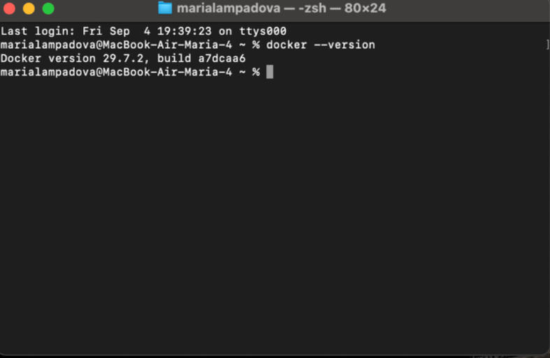
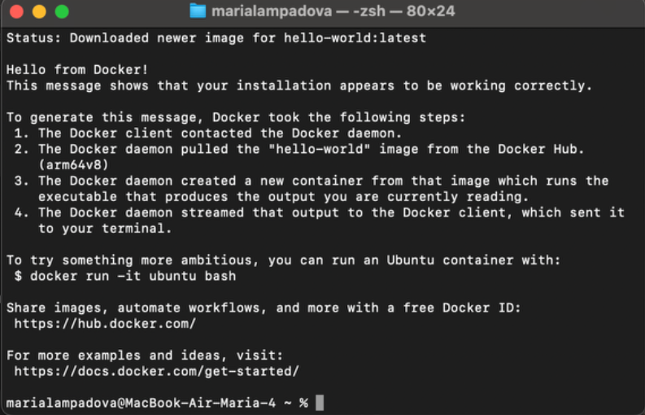
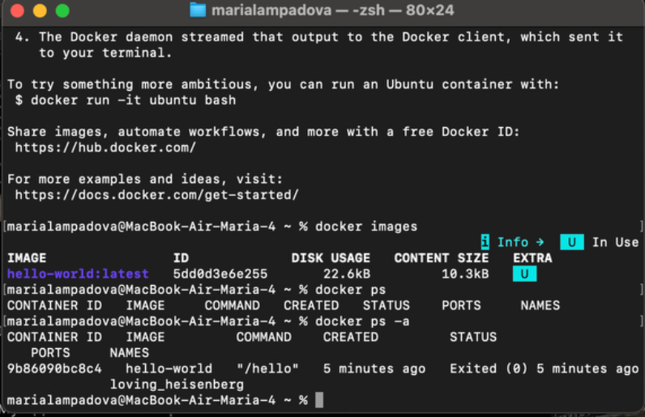
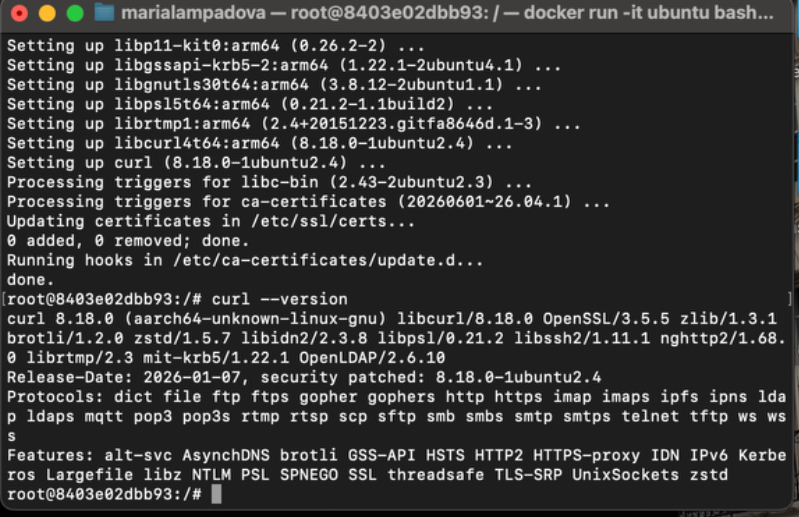
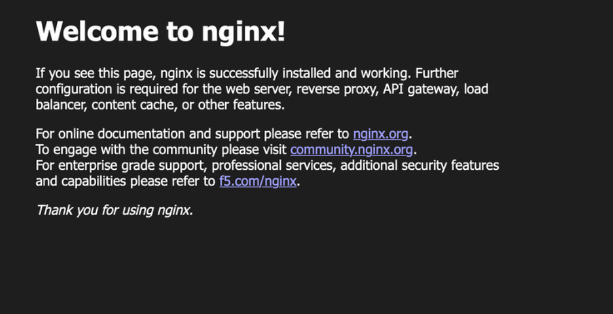
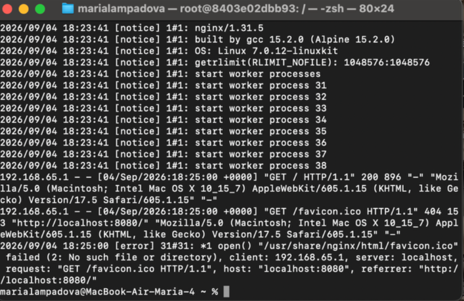
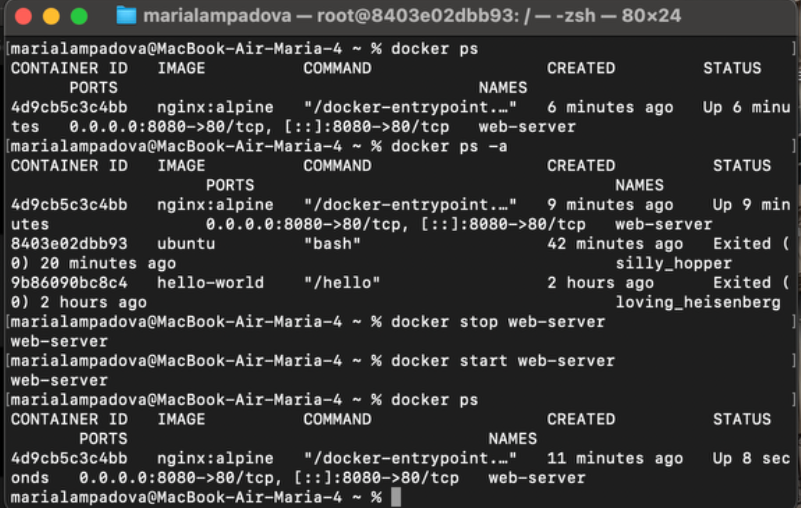
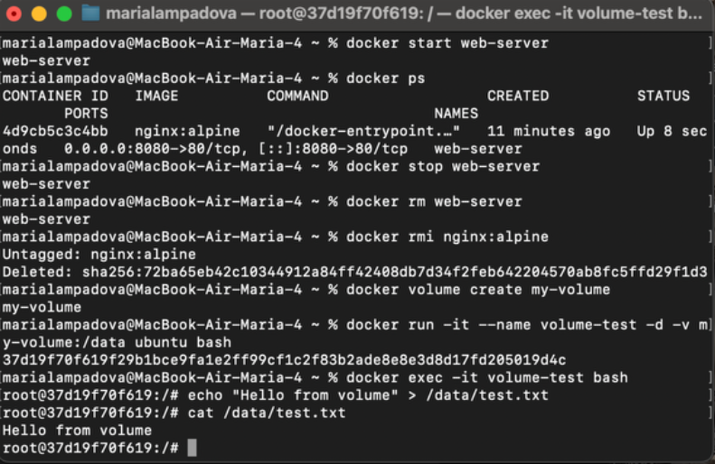
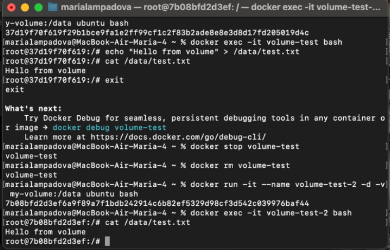

University: [ITMO University](https://itmo.ru/ru/)
Faculty: [FICT](https://fict.itmo.ru)
Course: [Введение в веб технологии](https://itmo-ict-faculty.github.io/introduction-in-web-tech/)
Year: 2026/2027
Group: ВвВТ УВБ 3.1
Author: Лампадова Мария Витальевна
Lab: Lab1
Date of create: 04.09.2026
Date of finished:
# Лабораторная работа №1. Основы работы с Docker

## Цель работы

Изучить основные возможности Docker: установку и настройку Docker Desktop, работу с образами и контейнерами, запуск веб-сервера, управление контейнерами и использование томов для хранения данных.

## Ход работы

### 1. Установка и проверка Docker

Для выполнения лабораторной работы был установлен Docker Desktop для macOS с процессором Apple Silicon.

Установка Docker была проверена командой:

docker --version

После этого был запущен тестовый контейнер:

docker run hello-world

В результате было получено сообщение Hello from Docker!, подтверждающее корректную работу Docker.

Также были изучены базовые команды:

docker images

docker ps

docker ps -a

Команда docker images позволяет просмотреть скачанные образы, docker ps — работающие контейнеры, а docker ps -a — все контейнеры, включая остановленные.

### 2. Работа с образом Ubuntu

Был скачан официальный образ Ubuntu:

docker pull ubuntu:latest

После этого был запущен интерактивный контейнер:

docker run -it ubuntu bash

Внутри контейнера был установлен пакет curl:

apt update && apt install -y curl

Корректность установки была проверена командой:

curl --version

После завершения работы выход из контейнера был выполнен командой:

exit

### 3. Запуск веб-сервера nginx

Для запуска веб-сервера был создан контейнер на основе образа nginx:alpine:

docker run -d -p 8080:80 --name web-server nginx:alpine

Работа сервера была проверена в браузере по адресу http://localhost:8080. Отобразилась стандартная страница Welcome to nginx!.

Логи контейнера были просмотрены командой:

docker logs web-server

Для подключения к командной оболочке работающего контейнера использовалась команда:

docker exec -it web-server sh

### 4. Управление контейнерами

Список запущенных контейнеров был просмотрен командой:

docker ps

Список всех контейнеров:

docker ps -a

Контейнер web-server был остановлен:

docker stop web-server

После этого контейнер был повторно запущен:

docker start web-server

Затем контейнер был остановлен и удалён:

docker stop web-server

docker rm web-server

Образ nginx был удалён командой:

docker rmi nginx:alpine

### 5. Работа с томами Docker

Был создан Docker-том:

docker volume create my-volume

После этого был запущен контейнер Ubuntu с подключением созданного тома к каталогу /data:

docker run -it --name volume-test -d -v my-volume:/data ubuntu bash

Для подключения к контейнеру использовалась команда:

docker exec -it volume-test bash

В подключённом томе был создан файл:

echo "Hello from volume" > /data/test.txt

Его содержимое было проверено командой:

cat /data/test.txt

Был получен результат:

Hello from volume

После этого первый контейнер был остановлен и удалён:

docker stop volume-test

docker rm volume-test

Был создан новый контейнер с тем же томом:

docker run -it --name volume-test-2 -d -v my-volume:/data ubuntu bash

После подключения к новому контейнеру содержимое файла было повторно проверено:

cat /data/test.txt

В результате снова было получено:

Hello from volume

Это подтвердило, что данные хранятся в Docker-томе и сохраняются после удаления контейнера.

## Вывод

В ходе лабораторной работы были изучены основные принципы работы Docker. Был установлен и проверен Docker Desktop, выполнена работа с готовыми образами Ubuntu и nginx, изучены команды запуска, остановки и удаления контейнеров. Также была изучена работа с Docker volumes и подтверждено сохранение данных после удаления контейнера.

## Скриншоты выполнения работы

### Проверка установленной версии Docker

### Запуск тестового контейнера hello-world

### Просмотр контейнеров

### Проверка установки curl в Ubuntu

### Проверка работы nginx в браузере

### Просмотр логов nginx

### Остановка и повторный запуск контейнера

### Создание файла в Docker volume

### Проверка сохранения данных в Docker volume

